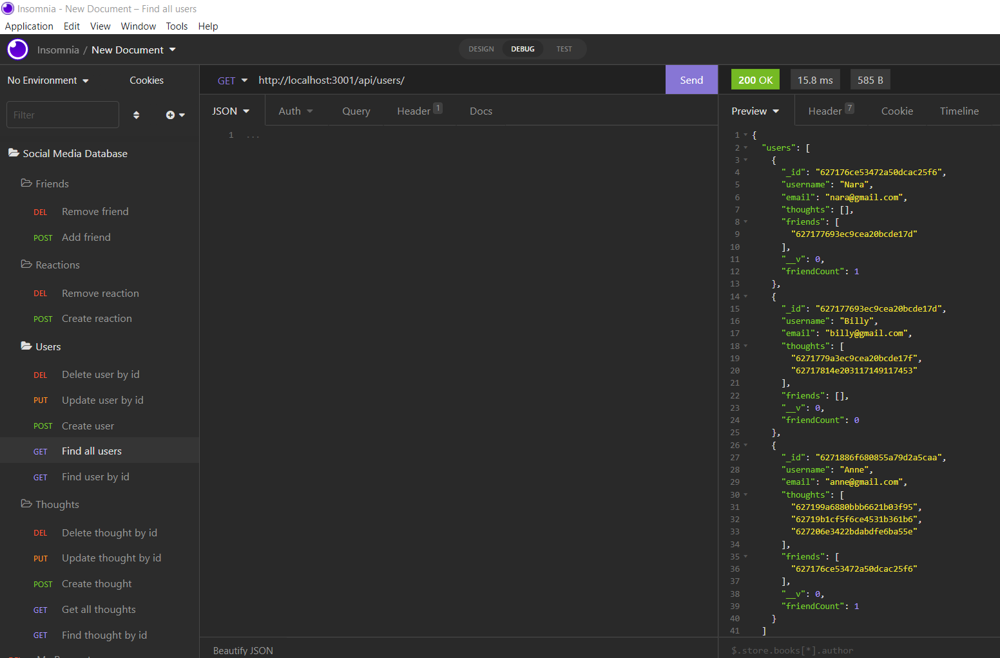

# nara-social-media-API

Bootcamp Week 18: Homework

# 18 NoSQL: Social Network API

## Table of Contents 

- [About Task](#about-task)
- [User Story](#user-story)
- [Getting Started](#getting-started)
- [Database Models](#database-models)
- [My Solution](#my-solution)
- [Walkthrough Video](#walkthrough-video)

## About Task

MongoDB is a popular choice for many social networks due to its speed with large amounts of data and flexibility with unstructured data. My task is to build an API for a social network web application where users can share their thoughts, react to friends’ thoughts, and create a friend list. This app uses [Express.js](https://www.npmjs.com/package/express) for routing, a [MongoDB](https://www.mongodb.com/) database, and the [Mongoose ODM](https://www.npmjs.com/package/mongoose). Because this application won’t be deployed, a walkthrough video demonstrates its functionality using Insomnia.

## User Story

```md
AS A social media startup
I WANT an API for my social network that uses a NoSQL database
SO THAT my website can handle large amounts of unstructured data
```

## Database Models

The database name: `socialmediaDB` contains the following Models:

- User (referenced document)
- Thought (referenced document)
- Reaction (SCHEMA ONLY - embedded document) 

**User**:

* `username`
  * String
  * Unique
  * Required
  * Trimmed

* `email`
  * String
  * Required
  * Unique
  * Must match a valid email address

* `thoughts`
  * Array of `_id` values referencing the `Thought` model

* `friends`
  * Array of `_id` values referencing the `User` model (self-reference)

**Schema Settings**:

Created a virtual called `friendCount` that retrieves the length of the user's `friends` array field on query.

---

**Thought**:

* `thoughtText`
  * String
  * Required
  * 280 character maximum

* `createdAt`
  * Date
  * Set default value to the current timestamp
  * Uses a getter method to format the timestamp on query

* `username` (The user that created this thought)
  * String
  * Required

* `reactions` (These are like replies)
  * Array of nested documents created with the `reactionSchema`

**Schema Settings**:

Created a virtual called `reactionCount` that retrieves the length of the thought's `reactions` array field on query.

---

**Reaction** (SCHEMA ONLY)

* `reactionId`
  * Uses Mongoose's ObjectId data type
  * Default value is set to a new ObjectId

* `reactionBody`
  * String
  * Required
  * 280 character maximum

* `username`
  * String
  * Required

* `createdAt`
  * Date
  * Set default value to the current timestamp
  * Uses a getter method to format the timestamp on query

**Schema Settings**:

This will not be a model, but rather will be used as the `reaction` field's subdocument schema in the `Thought` model.

## My Solution

Once this social network API application is invoked, my server is started and the Mongoose models are synced to the MongoDB database.

When I open API GET routes in Insomnia for users and thoughts, the data for each of these routes is displayed in a formatted JSON. Also, I test API POST, PUT, and DELETE routes in Insomnia, I am able to successfully create, update, and delete users and thoughts in my database.

When I test API POST and DELETE routes in Insomnia, I am able to successfully create and delete reactions to thoughts and add and remove friends to a user’s friend list.

When the user creates a new thought, the created thought's `_id` pushed to the associated user's `thoughts` array field. 

**Note**: Application deletes a user's associated thoughts when the user is deleted. It works like "DELETE ON CASCADE" functionality as relational database model.

To validate the user's email address, I uses the regex and Mongoose's matching validation.

### API Routes

```
Insomnia
|
Social Media Database
|
├── Users                              /api/users/
│   ├── GET   Find all users               
│   ├── GET   Find user by id    
│   ├── POST  Create user               
│   ├── PUT   Update user by id               
│   └── DEL   Delete user by id
├── Thoughts                           /api/thoughts/
│   ├── GET   Find all thoughts              
│   ├── GET   Find thought by id   
│   ├── POST  Create thought           
│   ├── PUT   Update thought by id               
│   └── DEL   Delete thought by id
├── Friends                     
│   ├── POST  Add friend               /api/users/:id/friends/
│   └── DEL   Remove friend            /api/users/:id/friends/:id
└── Reactions                  
    ├── POST  Create reaction          /api/thoughts/:id/reactions/       
    └── DEL   Remove reaction          /api/thoughts/:id/reactions/:id
```

The following image shows examples of the application's API routes in Insomnia.



**Note**: I added a custom JavaScript `Date` object to format timestamps.

## Walkthrough Video

The following walkthrough videos demonstrate the API routes functionality in the NoSQL database using the Insomnia app. 

Walkthrough Videos - on Youtube:

- GET all, GET by id, and  POST operations in Users and Thoughts documents [Start](https://youtu.be/5fiOzva_Rww) 
- PUT and DELETE by id operations in User and Thoughts documents [End](https://youtu.be/_url8Lk2rWA)  
- POST and DELETE operations in Friends and Reactions documents [Middle](https://youtu.be/T1rk6CGsmHQ)  

If you have any questions about the repo, open an issue or contact me directly at naraamtm@gmail.com. Here is a link to this application repo on [Github: social-media-API](https://github.com/Nara1469/nara-social-media-API).